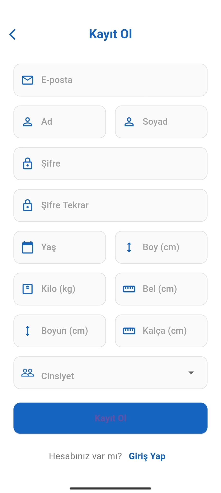
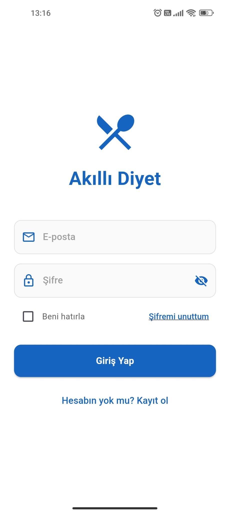
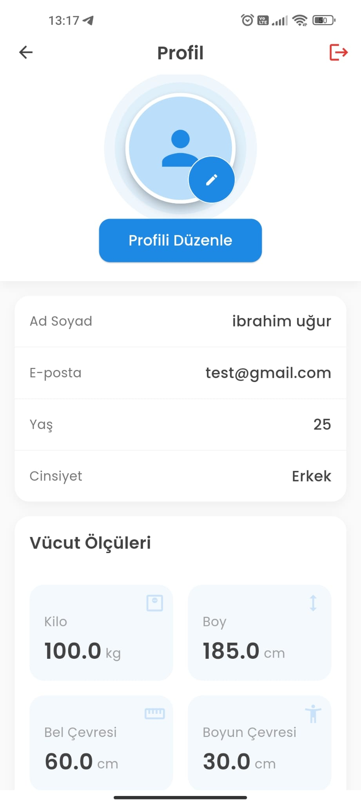
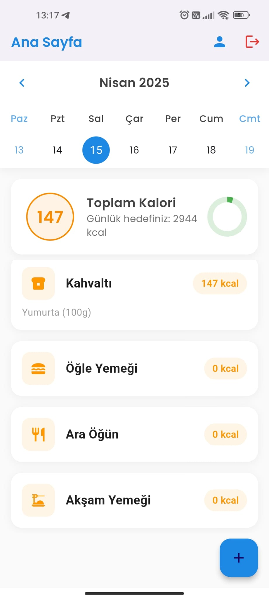
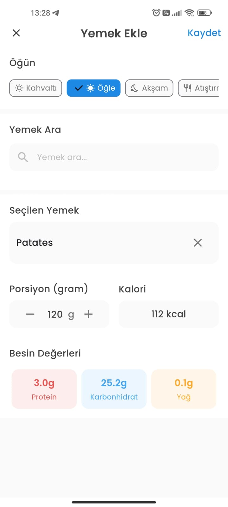
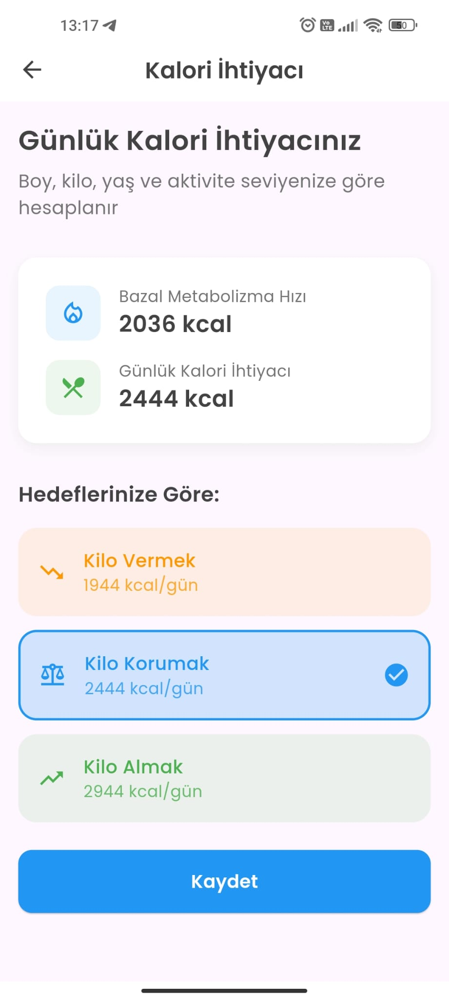
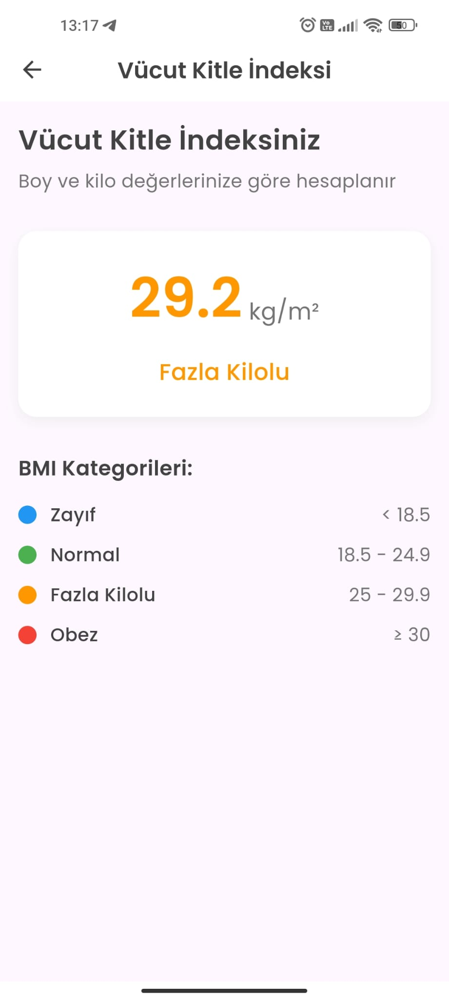
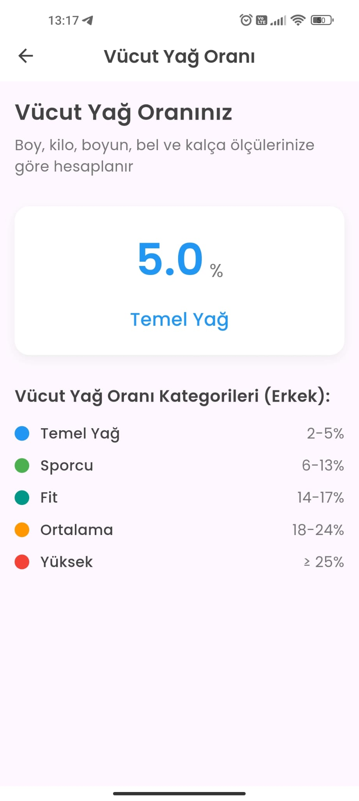
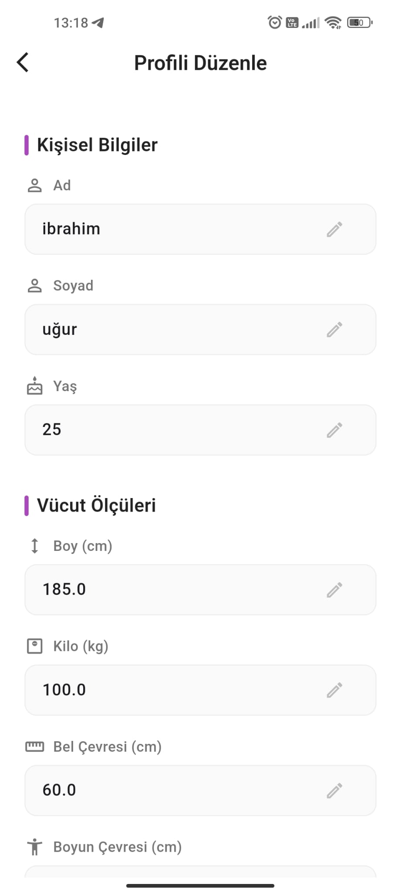

# 🏋️‍♂️ FitTakip - Sağlıklı Yaşam Asistanı

Firebase tabanlı, kişisel sağlık verilerinizi yönetebileceğiniz ve beslenme takibi yapabileceğiniz akıllı mobil uygulama.

<div align="center">
  
  
  
  
</div>

## ✨ Temel Özellikler

### 📊 Sağlık Analizleri
- Vücut Kitle İndeksi (BMI) hesaplama
- Vücut yağ oranı analizi
- Günlük kalori ihtiyacı belirleme
- Hedefe göre kalori planı oluşturma

### 🍎 Beslenme Takibi
- Öğün bazlı kalori kaydı
- 1000+ besin veritabanı entegrasyonu
- Günlük besin değerleri takibi
- Otomatik kalori hesaplama

### 🔐 Kişisel Yönetim
- Güvenli Firebase kayıt/giriş
- OTP doğrulama desteği
- Profil ve vücut ölçüleri yönetimi
- İlerleme takip sistemi

## 📱 Ekran Görüntüleri

<div align="center">
  <table>
    <tr>
      <td></td>
      <td></td>
      <td></td>
    </tr>
    <tr>
      <td><i>Kayıt Ekranı</i></td>
      <td><i>Giriş Yap</i></td>
      <td><i>Profil Bilgileri</i></td>
    </tr>
  </table>

  <table>
    <tr>
      <td></td>
      <td></td>
      <td></td>
    </tr>
    <tr>
      <td><i>Ana Takip Paneli</i></td>
      <td><i>Öğün Ekleme</i></td>
      <td><i>Kalori Analizi</i></td>
    </tr>
  </table>

  <table>
    <tr>
      <td></td>
      <td></td>
      <td></td>
    </tr>
    <tr>
      <td><i>VKİ Analizi</i></td>
      <td><i>Yağ Oranı</i></td>
      <td><i>Profil Düzenleme</i></td>
    </tr>
  </table>
</div>

## 🛠️ Kullanılan Teknolojiler

| Bileşen          | Teknoloji                     | Açıklama                          |
|------------------|-------------------------------|-----------------------------------|
| Framework        | Flutter                       | Çapraz platform geliştirme        |
| State Management | GetX                          | Uygulama durum yönetimi           |
| Backend          | Firebase                      | Veritabanı ve kimlik doğrulama    |
| API              | Calorie Ninjas                | Besin bilgileri ve kalori verileri|
| Analiz           | Health Metrics API            | Sağlık verileri analizi           |
| Storage          | Firebase Storage              | Kullanıcı bilgileri depolama      |

## 📦 Kurulum

1. Projeyi klonlayın:
```bash
git clone https://github.com/kullaniciAdiniz/fit-takip.git
